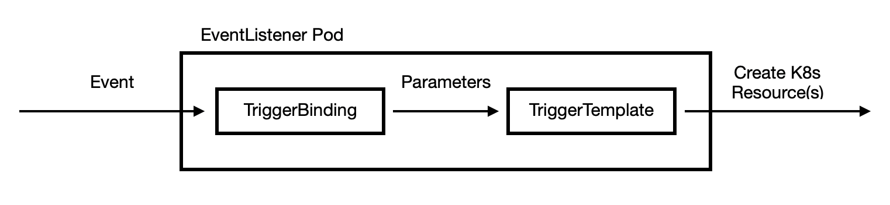

// This module is included in the following assembly:
//
// assembly_creating-applications-with-cicd-pipelines.adoc

[id="defining-and-creating-pipeline-tasks_{context}"]
= Defining and adding Triggers to a Pipeline

_Pipeline Triggers_ enables you to capture the external events and process them to extract key pieces of information. The extracted information from the received event payload is mapped to a set of predefined parameters, which trigger a series of tasks that may involve creation and deployment of Kubernetes resources. By using Triggers in conjunction with Pipelines, you can easily create a full-fledged CI/CD systems where the execution is defined entirely through Kubernetes resources.

Consider a simple scenario, where you have an application which is being worked upon by various developers distributed across globe. You have also defined a CI/CD workflow for your application using Pipelines. For any change in your repository, you have to explicitly start the PipelineRun for the new changes to take affect. Triggers automate this process, where any change in the repository triggers an event. This event is captured and processed to invoke a PipelineRun and eventually deploy the new image with the latest changes.

Triggers consist of the following main components which work together to form a reusable, decoupled and self-sustaining CI/CD system:

* _EventListeners_ provide endpoints, or an event sink, that listens for incoming HTTP based events with JSON payload. It performs a lightweight event processing on the payload using Event Interceptors, which identify the type of payload and optionally modify it. Currently, Pipeline Triggers support four types of Interceptors --Webhook Interceptors, GitHub Interceptors, GitLab Interceptors, and CEL Interceptors.
* _TriggerBindings_ extracts the fields from an event payload and stores them as parameters.
* _TriggerTemplates_ specify how to use the parameterized data from the TriggerBindings. It defines a resource template which takes as input the trigger bindings, and performs a series of actions that result in creation of new PipelineResources and starting of a new PipelineRun.

To sum up, EventListeners tie the concept of TriggerBindings and TriggerTemplates together. It listens for the incoming event, handles basic filtering using Interceptors, extracts data using TriggerBindings, and processes this data to create Kubernetes resources using TriggerTemplates.

== Procedure
After you have assembled the pipeline for the application, add TriggerTemplates, TriggerBindings, and EventListener to capture GitHub events.

. Copy the content of the following sample `TriggerBinding` YAML file and save it.
+
----
apiVersion: tekton.dev/v1alpha1
kind: TriggerBinding
metadata:
  name: vote-app-pipelinebinding
spec:
  params:
  - name: git-revision
    value: $(body.head_commit.id)
  - name: namespace
    value: pipelines-tutorial
  - name: git-repo-url
    value: $(body.repository.url)
  - name: git-repo-name
    value: $(body.repository.name)
----

. Create the `TriggerBinding`
+
----
$ oc create -f https://raw.githubusercontent.com/openshift/pipelines-tutorial/master/03_triggers/01_binding.yaml
----

. Copy the content of the following sample `TriggerTemplate` YAML file and save it.
+
----
apiVersion: tekton.dev/v1alpha1
kind: TriggerTemplate
metadata:
  name: vote-app-triggertemplate
spec:
  params:
  - name: git-revision
    description: The git revision
    default: master
  - name: git-repo-url
    description: The git repository url
  - name: namespace
    description: The namespace to create the resources
  - name: git-repo-name
    description: The name of the deployment to be created / patched
  resourcetemplates:
  - apiVersion: tekton.dev/v1alpha1
    kind: PipelineResource
    metadata:
      name: source-repo-$(params.git-repo-name)-$(uid)
      namespace: $(params.namespace)
    spec:
      type: git
      params:
      - name: revision
        value: $(params.git-revision)
      - name: url
        value: $(params.git-repo-url)
  - apiVersion: tekton.dev/v1alpha1
    kind: PipelineResource
    metadata:
      name: image-source-$(params.git-repo-name)-$(uid)
      namespace: $(params.namespace)
    spec:
      type: image
      params:
      - name: url
        value: image-registry.openshift-image-registry.svc:5000/$(params.namespace)/$(params.git-repo-name):latest
  - apiVersion: tekton.dev/v1alpha1
    kind: PipelineRun
    metadata:
      name: build-deploy-$(params.git-repo-name)-$(uid)
      namespace: $(params.namespace)
    spec:
      pipelineRef:
        name: build-and-deploy
      resources:
      - name: git-repo
        resourceRef:
          name: source-repo-$(params.git-repo-name)-$(uid)
      - name: image
        resourceRef:
          name: image-source-$(params.git-repo-name)-$(uid)
      params:
      - name: deployment-name
        value: $(params.git-repo-name)

----

. Create the `TriggerTemplate`
+
----
$ oc create -f https://raw.githubusercontent.com/openshift/pipelines-tutorial/master/03_triggers/02_template.yaml
----

. Copy the contents of the following sample `EventListener` YAML file and save it
+
----
apiVersion: tekton.dev/v1alpha1
kind: EventListener
metadata:
  name: voteapp-listener
spec:
  serviceAccountName: pipeline
  triggers:
    - name: vote-app-trig
      bindings:
      - name: vote-app-pipelinebinding
      template:
        name: vote-app-triggertemplate
----

. Create `EventListener`
+
----
$ oc create -f https://raw.githubusercontent.com/openshift/pipelines-tutorial/master/03_triggers/03_event_listener.yaml
----
+
[NOTE]
====
EventListener setups a Service. However, this Service needs to be exposed as an OpenShift Route to make it publicly accessible.
====

. Expose EventListener service as a route
+
----
$ oc expose svc el-voteapp-listener
----
[discrete]
== Additional resources

*
